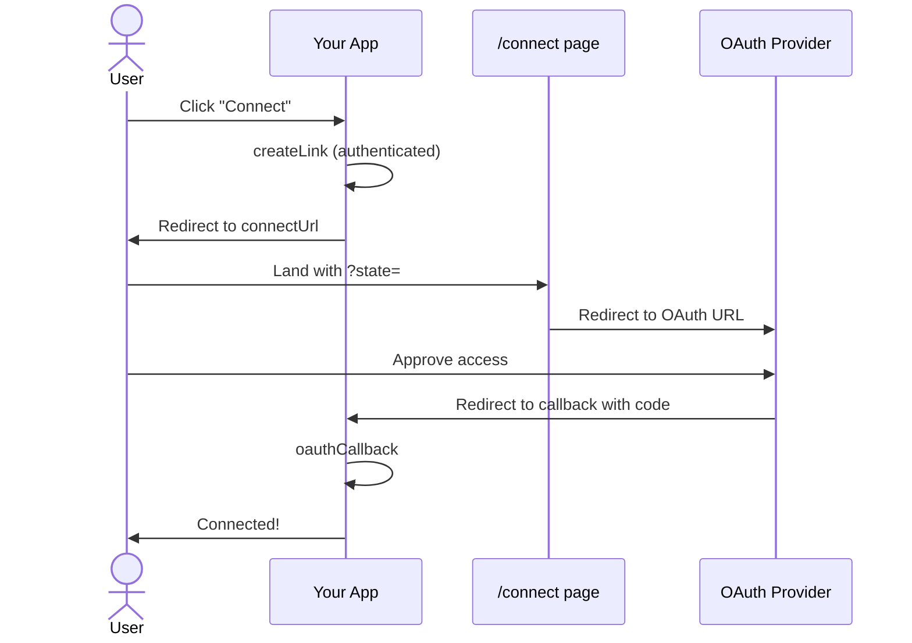

OAuth lets your users connect their own accounts to your app. Corsair handles state signing, token exchange, and encrypted storage — you wire up the connect flow.

Corsair supports two connect modes:

| Mode | Config | What you build |
| ---- | ------ | -------------- |
| **Hub** | `hub: { ... }` | Mint a link, redirect to Corsair Hub — see [Connect / OAuth](/management/connect) |
| **Manual** | `manual: { baseUrl, redirectUri }` | Connect page + OAuth callback (this guide) |

This page covers **manual mode** in production. The flow uses `client.connect.createLink()` — one API for minting connect URLs.



Corsair handles CSRF protection via HMAC-signed state, token encryption, and automatic refresh before API calls.

---

<Steps>

<Step>

## Configure your app

Add OAuth plugins, `database`, `kek`, and **manual** connect config. Mount the [management handler](/management/handler) so `createLink` is available over HTTP.

```ts corsair.ts
import { createCorsair } from 'corsair';
import { gmail } from '@corsair-dev/gmail';

export const corsair = createCorsair({
    plugins: [gmail()],
    kek: process.env.CORSAIR_KEK!,
    database: db,
    manual: {
        baseUrl: `${process.env.APP_URL}/connect`,
        redirectUri: `${process.env.APP_URL}/api/oauth/callback`,
    },
});
```

```ts app/api/corsair/[[...path]]/route.ts
import { toNextJsHandler } from 'corsair';
import { corsair } from '@/server/corsair';

export const { GET, POST, OPTIONS } = toNextJsHandler(corsair, {
    basePath: '/api/corsair',
});
```

Store your OAuth app credentials once:

```bash
pnpm corsair setup --plugin=gmail client_id=YOUR_CLIENT_ID client_secret=YOUR_CLIENT_SECRET
```

<Info>
OAuth is supported by plugins like Gmail, Google Calendar, Notion, Spotify, Dropbox, and others.
</Info>

</Step>

<Step>

## Create the connect link

When a user clicks "Connect", call `createLink` on your **authenticated** backend. Read `tenantId` from your session — never from the request body alone in production.

<Warning>
**This step must be authenticated.** If left open, anyone could mint connect links for arbitrary tenants. Always resolve `tenantId` from your session before calling `createLink`.
</Warning>

<Tabs>

<Tab title="Next.js (server action)">

```ts app/actions/connect.ts
'use server';

import { corsair } from '@/server/corsair';
import { getSessionTenantId } from '@/server/auth';

export async function createConnectLink(plugin: string) {
    const tenantId = await getSessionTenantId();
    if (!tenantId) throw new Error('Unauthorized');

    return corsair.manage.connect.createLink({ plugin, tenantId });
}
```

```tsx connect-button.tsx
'use client';

import { createConnectLink } from '@/app/actions/connect';

export function ConnectGmail() {
    return (
        <button
            onClick={async () => {
                const { connectUrl } = await createConnectLink('gmail');
                window.location.href = connectUrl;
            }}
        >
            Connect Gmail
        </button>
    );
}
```

</Tab>

<Tab title="Next.js (API route)">

```ts app/api/corsair/connect/links/route.ts
import { NextResponse } from 'next/server';
import { corsair } from '@/server/corsair';
import { getSessionTenantId } from '@/server/auth';

export async function POST(request: Request) {
    const tenantId = await getSessionTenantId(request);
    if (!tenantId) {
        return NextResponse.json({ error: 'Unauthorized' }, { status: 401 });
    }

    const { plugin } = (await request.json()) as { plugin?: string };
    if (!plugin) {
        return NextResponse.json({ error: 'plugin is required' }, { status: 400 });
    }

    const link = await corsair.manage.connect.createLink({ plugin, tenantId });
    return NextResponse.json(link);
}
```

Or proxy the full management handler at `/api/corsair/[...path]` and POST to `/api/corsair/connect/links` from the client with your auth middleware in front.

</Tab>

<Tab title="Express">

```ts routes/connect-link.ts
import type { Request, Response } from 'express';
import { corsair } from '../corsair';

export async function createConnectLinkHandler(req: Request, res: Response) {
    const tenantId = req.session?.userId;
    if (!tenantId) {
        res.status(401).json({ error: 'Unauthorized' });
        return;
    }

    const plugin = req.body?.plugin as string | undefined;
    if (!plugin) {
        res.status(400).json({ error: 'plugin is required' });
        return;
    }

    const link = await corsair.manage.connect.createLink({ plugin, tenantId });
    res.json(link);
}
```

</Tab>

</Tabs>

`createLink` returns `{ connectUrl, expiresAt }`. Redirect the user's browser to `connectUrl`. The signed `state` is already embedded in that URL.

</Step>

<Step>

## The connect page

`connectUrl` points at your `manual.baseUrl` with `?state=…`. This page verifies the state and redirects the user to the provider's OAuth screen.

<Tabs>

<Tab title="Next.js">

```ts app/connect/page.tsx
import { redirect } from 'next/navigation';
import { corsair } from '@/server/corsair';

export default async function ConnectPage({
    searchParams,
}: {
    searchParams: Promise<{ state?: string }>;
}) {
    const { state } = await searchParams;
    if (!state) {
        return <p>Missing state.</p>;
    }

    const { oauthUrl } = await corsair.manage.connect.resolve(state);
    redirect(oauthUrl);
}
```

</Tab>

<Tab title="Express">

```ts routes/connect-page.ts
import type { Request, Response } from 'express';
import { corsair } from '../corsair';

export async function connectPageHandler(req: Request, res: Response) {
    const state = req.query.state as string | undefined;
    if (!state) {
        res.status(400).send('Missing state.');
        return;
    }

    try {
        const { oauthUrl } = await corsair.manage.connect.resolve(state);
        res.redirect(oauthUrl);
    } catch (err) {
        const message = err instanceof Error ? err.message : String(err);
        res.status(400).send(message);
    }
}
```

</Tab>

</Tabs>

</Step>

<Step>

## The callback route

After the user approves, the provider redirects to `manual.redirectUri` with `?code=` and `?state=`. Exchange the code for tokens and store them encrypted for the tenant.

<Warning>
Corsair re-verifies the HMAC-signed `state` inside `oauthCallback`. The `tenantId` and `plugin` are extracted from state — do not trust query parameters for tenant identity.
</Warning>

<Tabs>

<Tab title="Next.js">

```ts app/api/oauth/callback/route.ts
import type { NextRequest } from 'next/server';
import { NextResponse } from 'next/server';
import { corsair } from '@/server/corsair';

function escapeHtml(value: string): string {
    return value
        .replace(/&/g, '&amp;')
        .replace(/</g, '&lt;')
        .replace(/>/g, '&gt;')
        .replace(/"/g, '&quot;')
        .replace(/'/g, '&#x27;');
}

export async function GET(request: NextRequest) {
    const { searchParams } = new URL(request.url);
    const code = searchParams.get('code');
    const state = searchParams.get('state');
    const error = searchParams.get('error');

    if (error) {
        return new NextResponse(
            `<html><body><h2>Authorization failed</h2><p>${escapeHtml(error)}</p></body></html>`,
            { status: 400, headers: { 'Content-Type': 'text/html' } },
        );
    }

    if (!code || !state) {
        return new NextResponse('<p>Missing code or state.</p>', { status: 400 });
    }

    try {
        const result = await corsair.manage.connect.oauthCallback({ code, state });

        return NextResponse.redirect(
            `/dashboard?connected=${encodeURIComponent(result.plugin)}`,
        );
    } catch (err) {
        const message = err instanceof Error ? err.message : String(err);
        return new NextResponse(
            `<html><body><h2>OAuth error</h2><p>${escapeHtml(message)}</p></body></html>`,
            { status: 500, headers: { 'Content-Type': 'text/html' } },
        );
    }
}
```

</Tab>

<Tab title="Express">

```ts routes/oauth-callback.ts
import type { Request, Response } from 'express';
import { corsair } from '../corsair';

function escapeHtml(value: string): string {
    return value
        .replace(/&/g, '&amp;')
        .replace(/</g, '&lt;')
        .replace(/>/g, '&gt;')
        .replace(/"/g, '&quot;')
        .replace(/'/g, '&#x27;');
}

export async function oauthCallbackHandler(req: Request, res: Response) {
    const code = req.query.code as string | undefined;
    const state = req.query.state as string | undefined;
    const error = req.query.error as string | undefined;

    if (error) {
        res.status(400).send(
            `<html><body><h2>Authorization failed</h2><p>${escapeHtml(error)}</p></body></html>`,
        );
        return;
    }

    if (!code || !state) {
        res.status(400).send('<p>Missing code or state parameter.</p>');
        return;
    }

    try {
        const result = await corsair.manage.connect.oauthCallback({ code, state });
        res.redirect(`/dashboard?connected=${encodeURIComponent(result.plugin)}`);
    } catch (err) {
        const message = err instanceof Error ? err.message : String(err);
        res.status(500).send(
            `<html><body><h2>OAuth error</h2><p>${escapeHtml(message)}</p></body></html>`,
        );
    }
}
```

</Tab>

</Tabs>

</Step>

</Steps>

---

## Environment variables

| Variable | Description |
|---|---|
| `CORSAIR_KEK` | Key-encryption key — generate with `openssl rand -hex 32`. Never rotate without re-encrypting stored DEKs. |
| `APP_URL` | Your app's public base URL (e.g. `https://myapp.com`). Used to build `manual.baseUrl` and `manual.redirectUri`. |
| `NODE_ENV` | Set to `production` to enable HTTPS-only cookies and other hardening elsewhere in your app. |

---

## Security checklist

<Check>`createLink` is behind authentication — `tenantId` comes from your session, not user input</Check>
<Check>`manual.baseUrl` and `manual.redirectUri` use your HTTPS domain in production</Check>
<Check>The connect page calls `resolve(state)` — Corsair verifies the HMAC before returning the OAuth URL</Check>
<Check>The callback calls `oauthCallback({ code, state })` — Corsair re-verifies state and exchanges the code</Check>
<Check>All user-controlled values are HTML-escaped before rendering error pages</Check>
<Check>OAuth redirect URI registered with the provider matches `manual.redirectUri` exactly</Check>

---

## Hub mode

If you prefer Corsair to host the connect UI, use `hub: { ... }` instead of `manual`. You only mint a link and mount a delivery endpoint — no connect page or callback route needed. Hub stores none of your credentials; tokens still land in your database.

See [Hub overview](/hub/overview) for the model, [Manual or Hub](/hub/manual-vs-hub) for a side-by-side, and [Connect / OAuth](/management/connect) for the API.

---

## What's next

<CardGroup cols={2}>
  <Card title="Connect / OAuth" href="/management/connect">
    Unified createLink API — hub and manual modes.
  </Card>
  <Card title="OAuth 2.0 Concepts" href="/concepts/oauth">
    How Corsair encrypts and stores tokens, and handles automatic refresh.
  </Card>
  <Card title="Multi-Tenancy" href="/concepts/multi-tenancy">
    Scoping every API call and database query per user with withTenant().
  </Card>
  <Card title="Gmail Plugin" href="/plugins/gmail/overview">
    Set up Gmail OAuth — a common starting point.
  </Card>
</CardGroup>
