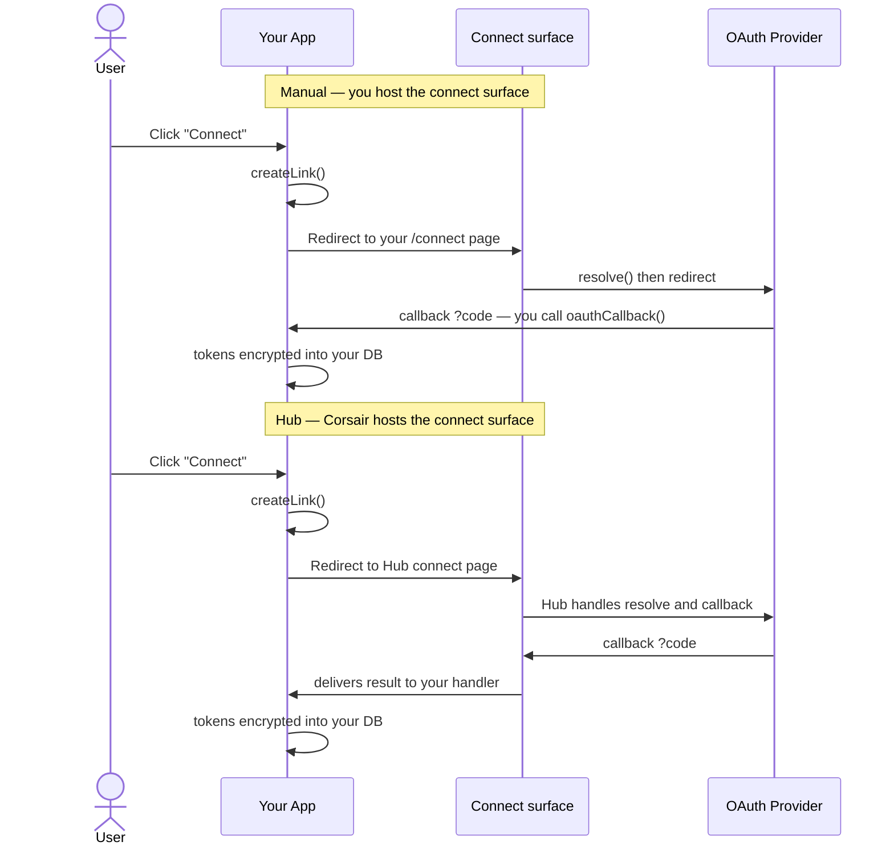

import CreateCorsairHub from '/snippets/create-corsair-hub.mdx';
import CreateCorsairManual from '/snippets/create-corsair-manual.mdx';

Corsair only differs between modes in one place: the surfaces that need a public URL (OAuth callbacks, approval pages). Everything else (calling APIs, `withTenant`, hooks, the database layer, encryption) is identical.

- **Hub** is the recommended path. Corsair hosts the connect, callback, and approval surfaces for you, and stores none of your credentials. See [Hub overview](/hub/overview).
- **Manual** is the self-hosted alternative. You host those surfaces yourself — fully featured, no external dependency.

The picker is config on `createCorsair`: pass `manual` or `hub`.

## What each mode asks you to build

| Surface | Manual (you host it) | Hub (Corsair hosts it) |
| ------- | -------------------- | ---------------------- |
| OAuth callback URL | One per environment, registered with each provider | One callback for [development and production](/hub/environments) |
| Connect page | You build it (`resolve` the signed state, redirect to provider) | Hosted by Hub |
| OAuth callback route | You build it (`oauthCallback` exchanges the code) | Hosted by Hub, result delivered to you |
| Approval UI | You build a review page and wire `onApprovalRequired` | Hosted approve/deny page, link auto-generated |
| Missing-connection error | You craft the message and build the connect page | You call `createLink()` for a sign-in link; Hub hosts the connect page |
| Credential storage | Your database | Your database (Hub stores nothing in both modes) |

The last row is the key one: **credential storage never changes.** Tokens live in your database under your KEK in both modes. Hub is a relay for the public-URL surfaces, not a vault.

## Config side by side

<Tabs>

<Tab title="Manual (self-hosted)">

<CreateCorsairManual />

You also build the connect page, the OAuth callback route, and the approval review page. See [OAuth Process](/concepts/oauth-process) for the full implementation.

</Tab>

<Tab title="Hub (hosted)">

<CreateCorsairHub />

No connect page, callback route, or approval page to build. Mount the handler once — Hub [delivers results](/hub/delivery-urls) to it (auto-detected locally, registered in the dashboard for production).

</Tab>

</Tabs>

Both modes use the same `createLink` API to start a connect flow. Only where the returned `connectUrl` points changes. See [Connect / OAuth](/management/connect).

## The connect flow in each mode

In both lanes the tokens end up in the same place: your database. Hub removes the two pages you would otherwise build, nothing more.

## Choosing a mode

Choose **manual** when you want full control of the connect and approval surfaces, need everything inside your own domain, or cannot add an external hop in the auth path.

Choose **hub** when you would rather not build and host those surfaces, or when you want one provider callback to cover [local development and production](/hub/environments) at once.

You can also mix: connect through Hub while keeping approvals manual, or the reverse. The two surfaces are configured independently.

## What's next

<CardGroup cols={2}>
  <Card title="Hub overview" href="/hub/overview">
    What Hub is and the relay / no-storage model.
  </Card>
  <Card title="Environments" href="/hub/environments">
    Development vs production keys and delivery.
  </Card>
  <Card title="OAuth Process" href="/concepts/oauth-process">
    The full manual-mode implementation with security best practices.
  </Card>
  <Card title="Connect / OAuth" href="/management/connect">
    The unified createLink API and its error codes.
  </Card>
  <Card title="Permissions" href="/concepts/permissions">
    Approval policies, modes, and the review flow.
  </Card>
</CardGroup>
